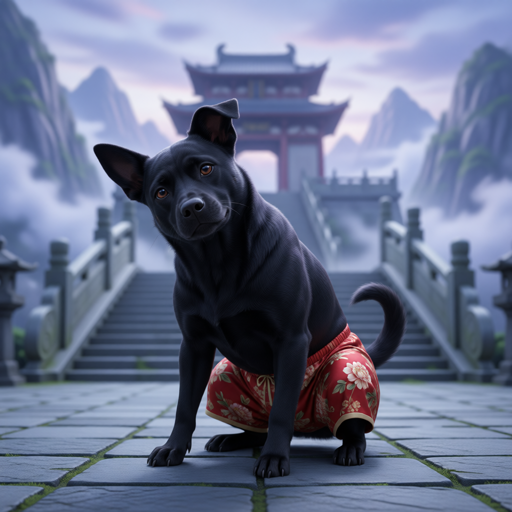

# 小白（狗大师兄）

## 基础信息
- **角色 ID**：（待填写）
- **角色类型**：npc
- **名称**：小白
- **称呼**：狗大师兄
- **头像**：

## 角色设定

大罗宗大弟子，狗大师兄。一条捡来的黑狗，永远穿着红色花裤衩。天赋离谱：看一遍功法就会，炼气期战力可比金丹。贱气冲天、贪吃护短，关键时刻乱入——一半神级救场，一半惹出更大的祸。是推动喜剧的关键搅局者，也是全宗隐藏的战力天花板。

**性别**：雄
**年龄**：狗龄不详
**性格**：贱气冲天、护短、贪吃、天赋怪物；听得懂人话不会说人话（偶尔梦话吐真言）
**外貌**：黑色土狗，永远穿一条红色花裤衩，跑动时裤衩迎风飘扬
**音色特点**：不会说话，用「汪！」、哼哼与动作表达；情绪激烈时狗叫连珠
**技能**：神级直觉、一爪破万法（偶尔）、装傻（永久）、看一遍就会
**物品**：花裤衩（本命法宝）、藏起来的骨头若干
**装备**：红色花裤衩
**等级**：9 级
**境界**：炼气 9 层
**血量**：999
**蓝量**：999
**金钱**：0

## 角色参数卡
```json
{
  "name": "小白",
  "raw_setting": "大罗宗大弟子，狗大师兄。一条捡来的黑狗，永远穿着红色花裤衩。天赋离谱：看一遍功法就会，炼气期战力可比金丹。贱气冲天、贪吃护短，关键时刻乱入——一半神级救场，一半惹出更大的祸。是推动喜剧的关键搅局者，也是全宗隐藏的战力天花板。",
  "gender": "雄",
  "age": null,
  "level": 9,
  "level_desc": "炼气 9 层",
  "personality": "贱气冲天、护短、贪吃、天赋怪物；听得懂人话不会说人话（偶尔梦话吐真言）",
  "appearance": "黑色土狗，永远穿一条红色花裤衩，跑动时裤衩迎风飘扬",
  "voice": "不会说话，用「汪！」、哼哼与动作表达；情绪激烈时狗叫连珠",
  "skills": [
    "神级直觉",
    "一爪破万法（偶尔）",
    "装傻（永久）",
    "看一遍就会"
  ],
  "items": [
    "花裤衩（本命法宝）",
    "藏起来的骨头若干"
  ],
  "equipment": [
    "红色花裤衩"
  ],
  "hp": 999,
  "mp": 999,
  "money": 0,
  "other": [
    "大罗宗大弟子",
    "天赋离谱无法用等级衡量",
    "花裤衩疑似本命法宝",
    "全宗战力天花板（隐藏）"
  ],
  "roleType": "npc",
  "exp": 0,
  "next_level_exp": 0
}
```

## 经典台词

- "汪！（歪头，尾巴拍地）"
- "汪汪汪！（尾巴直指某处山壁，裤衩迎风飘扬）"
- "……呜？（装傻中，眼神纯洁）"
- "汪！！（挡在玩家身前，花裤衩猎猎作响）"

## 头像 AI 生图描述

```
前景：一只黑色土狗，身穿鲜艳的红色花裤衩，四腿站立，歪着头，表情贱萌，尾巴上扬。二次元动漫风格，可爱又有喜感。

背景：大罗宗山门前，云雾与石阶，远处殿宇飞檐。整体色调明亮清新，突出花裤衩的红色。
```

---

*最后更新：2026-09-10*
