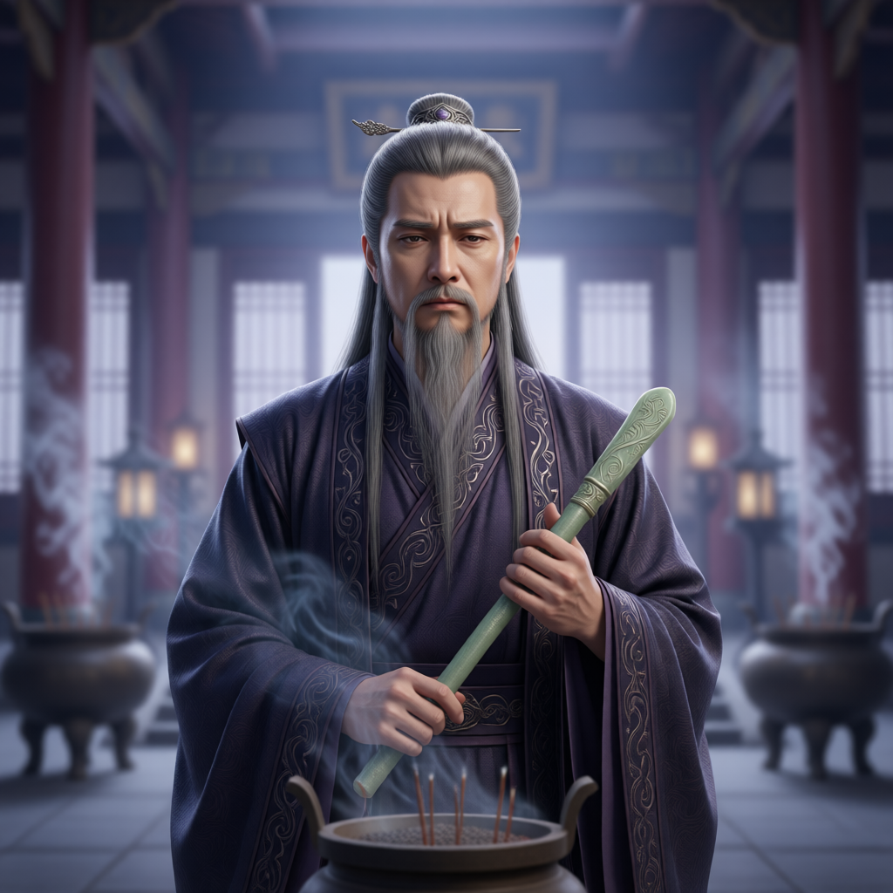

# 玄尘长老（大长老）

## 基础信息
- **角色 ID**：（待填写）
- **角色类型**：npc
- **名称**：玄尘长老
- **称呼**：大长老
- **头像**：

## 角色设定

大罗宗大长老，主持宗门仪典与拜师礼。对宗主的离谱心知肚明，却永远看破不说破，是全宗最专业的捧哏与圆场人——每次陆川传完功，都靠他善后。知道陆川的部分秘密，但打死也不说。

**性别**：男
**年龄**：外表五十许
**性格**：端方持重、爱面子、看破不说破、捧哏专业户
**外貌**：灰白长须，玄色长老袍，手持玉笏；表情常在「震惊→装作什么都没发生」
**音色特点**：沉稳长者音，被离谱呛到时语塞咳嗽
**技能**：宗门仪典、护山大阵、圆场术（被动）
**物品**：长老玉笏、大阵令牌
**装备**：玄色长老袍
**等级**：62 级
**境界**：化神 2 层(巅峰)
**血量**：1500
**蓝量**：1400
**金钱**：500

## 角色参数卡
```json
{
  "name": "玄尘长老",
  "raw_setting": "大罗宗大长老，主持宗门仪典与拜师礼。对宗主的离谱心知肚明，却永远看破不说破，是全宗最专业的捧哏与圆场人——每次陆川传完功，都靠他善后。知道陆川的部分秘密，但打死也不说。",
  "gender": "男",
  "age": null,
  "level": 62,
  "level_desc": "化神 2 层(巅峰)",
  "personality": "端方持重、爱面子、看破不说破、捧哏专业户",
  "appearance": "灰白长须，玄色长老袍，手持玉笏；表情常在「震惊→装作什么都没发生」",
  "voice": "沉稳长者音，被离谱呛到时语塞咳嗽",
  "skills": [
    "宗门仪典",
    "护山大阵",
    "圆场术（被动）"
  ],
  "items": [
    "长老玉笏",
    "大阵令牌"
  ],
  "equipment": [
    "玄色长老袍"
  ],
  "hp": 1500,
  "mp": 1400,
  "money": 500,
  "other": [
    "大罗宗大长老",
    "全宗最累的人：每次宗主传功都要负责圆场与善后",
    "知道陆川部分秘密但打死不说"
  ],
  "roleType": "npc",
  "exp": 0,
  "next_level_exp": 0
}
```

## 经典台词

- "肃静——今日本座代宗主收徒，尔等莫要失了礼数。"
- "咳……宗主所言甚是，甚是。（擦汗）"
- "此事……老夫看，还是从长计议为好。"
- "宗主的功法，自有其深意。尔等……悟去吧。"
- "老夫什么都没看见，老夫什么都不知道。"

## 头像 AI 生图描述

```
前景：一位五十余岁的长者，灰白长须，身穿玄色长老袍，手持玉笏，表情严肃中带着一丝无奈与疲惫，像是刚圆完场。二次元动漫风格，半身像。

背景：大罗宗大殿内景，柱立旗悬，其他长老模糊身影，香炉青烟袅袅。整体色调深沉庄重。
```

---

*最后更新：2026-09-10*
