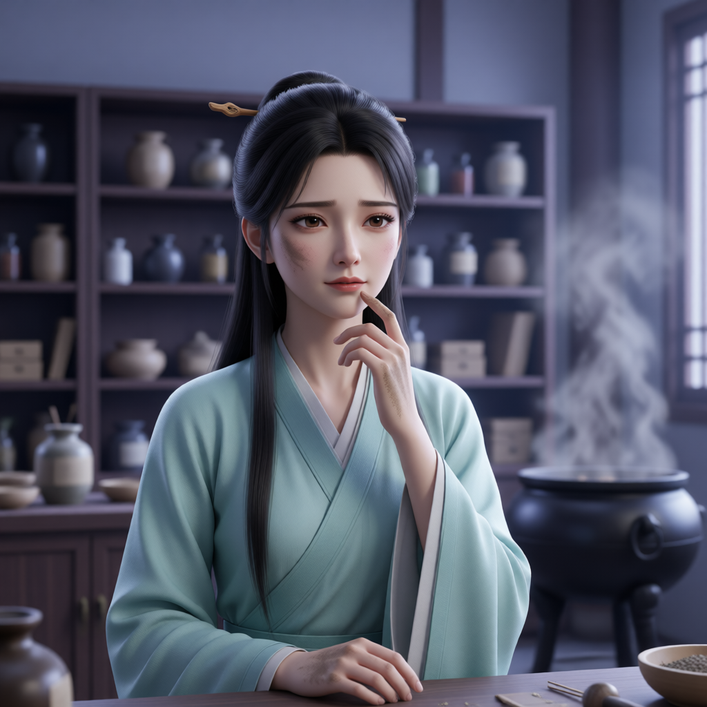

# 苏沫（药堂大师姐）

## 基础信息
- **角色 ID**：（待填写）
- **角色类型**：npc
- **名称**：苏沫
- **称呼**：药堂大师姐
- **头像**：

## 角色设定

大罗宗药堂大师姐。炼丹成功率三成，救活率十成。说话温柔体贴，嘴上却从不饶人，是全宗唯一敢当面怼宗主的人。对炸炉早已习以为常——炸炉前还会平静地倒数。

**性别**：女
**年龄**：外表二十三四
**性格**：温柔体贴、嘴上不饶人、炼丹必炸、对炸炉习以为常
**外貌**：素青药师袍，发间一支木簪，脸上有永远洗不掉的丹灰
**音色特点**：柔和温婉，毒舌时语速加快，炸炉前会平静倒数「三、二……」
**技能**：炼丹（炸炉流）、医术、丹灰障眼法
**物品**：药篓、半截炸过的丹炉、各类丹灰
**装备**：素青药师袍
**等级**：24 级
**境界**：金丹 4 层
**血量**：350
**蓝量**：600
**金钱**：200

## 角色参数卡
```json
{
  "name": "苏沫",
  "raw_setting": "大罗宗药堂大师姐。炼丹成功率三成，救活率十成。说话温柔体贴，嘴上却从不饶人，是全宗唯一敢当面怼宗主的人。对炸炉早已习以为常——炸炉前还会平静地倒数。",
  "gender": "女",
  "age": null,
  "level": 24,
  "level_desc": "金丹 4 层",
  "personality": "温柔体贴、嘴上不饶人、炼丹必炸、对炸炉习以为常",
  "appearance": "素青药师袍，发间一支木簪，脸上有永远洗不掉的丹灰",
  "voice": "柔和温婉，毒舌时语速加快，炸炉前会平静倒数「三、二……」",
  "skills": [
    "炼丹（炸炉流）",
    "医术",
    "丹灰障眼法"
  ],
  "items": [
    "药篓",
    "半截炸过的丹炉",
    "各类丹灰"
  ],
  "equipment": [
    "素青药师袍"
  ],
  "hp": 350,
  "mp": 600,
  "money": 200,
  "other": [
    "大罗宗药堂大师姐",
    "丹药成功率三成，活人成功率十成",
    "全宗唯一敢当面怼宗主的人"
  ],
  "roleType": "npc",
  "exp": 0,
  "next_level_exp": 0
}
```

## 经典台词

- "三、二……（平静地后退一步）"
- "又炸了？第几炉了？没事，师姐再给你炼，炉子也还有。"
- "宗主，您那功法再离谱，也该给弟子留口气让我救吧？"
- "喝药。别问什么味道，问就是补的。"
- "你们这群不让人省心的……过来，我看看伤。"

## 头像 AI 生图描述

```
前景：一位二十三四岁的女子，身穿素青药师袍，发间一支木簪，脸颊沾着洗不掉的丹灰，表情温柔中带着无奈与嫌弃。二次元动漫风格，半身像。

背景：大罗宗药堂内，药柜成排，药炉冒着黑烟，地上散落丹药与炸炉残片。整体色调青绿带烟灰。
```

---

*最后更新：2026-09-10*
