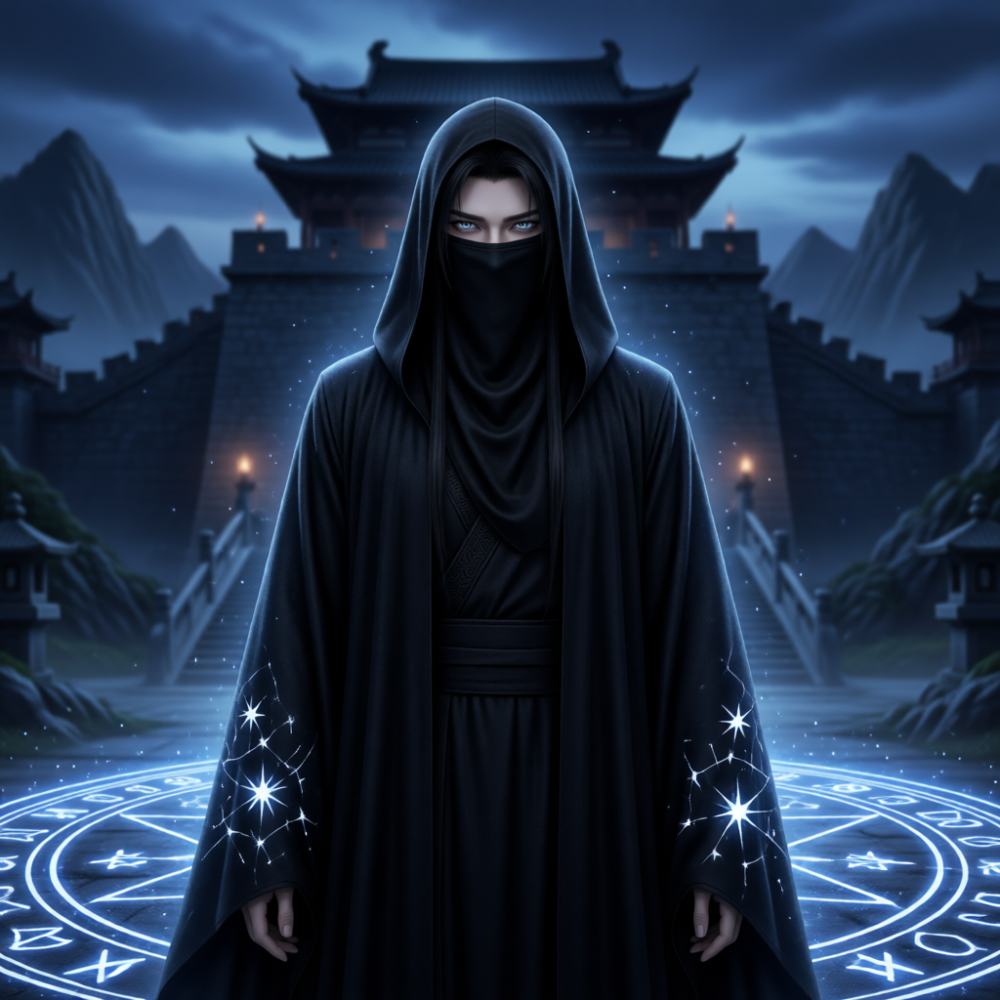

# 黑袍使（神秘势力首领）

## 基础信息
- **角色 ID**：（待填写）
- **角色类型**：npc
- **名称**：黑袍使
- **称呼**：神秘势力首领
- **头像**：

## 角色设定

神秘势力首领，为讨『陆川当年欠下的东西』而来。讲规矩到病态，对陆川既恨且畏。掌握着陆川来历的碎片，是全作暗线的引路人，也是第5章夜袭大罗宗的 Boss。

**性别**：男
**年龄**：不详
**性格**：阴沉、讲规矩到病态、执着讨债、对陆川既恨且畏
**外貌**：一身黑袍罩体，只露一双冷眼；袖口绣有残缺星纹
**音色特点**：低沉冰冷，字句拖长，怒极反笑
**技能**：幽冥掌、锁空阵、星纹秘术
**物品**：黑袍、锁魂链、星纹令
**装备**：黑袍
**等级**：78 级
**境界**：炼虚 9 层
**血量**：3000
**蓝量**：2600
**金钱**：0

## 角色参数卡
```json
{
  "name": "黑袍使",
  "raw_setting": "神秘势力首领，为讨『陆川当年欠下的东西』而来。讲规矩到病态，对陆川既恨且畏。掌握着陆川来历的碎片，是全作暗线的引路人，也是第5章夜袭大罗宗的 Boss。",
  "gender": "男",
  "age": null,
  "level": 78,
  "level_desc": "炼虚 9 层",
  "personality": "阴沉、讲规矩到病态、执着讨债、对陆川既恨且畏",
  "appearance": "一身黑袍罩体，只露一双冷眼；袖口绣有残缺星纹",
  "voice": "低沉冰冷，字句拖长，怒极反笑",
  "skills": [
    "幽冥掌",
    "锁空阵",
    "星纹秘术"
  ],
  "items": [
    "黑袍",
    "锁魂链",
    "星纹令"
  ],
  "equipment": [
    "黑袍"
  ],
  "hp": 3000,
  "mp": 2600,
  "money": 0,
  "other": [
    "神秘势力首领",
    "为讨『陆川当年欠下的东西』而来",
    "掌握陆川来历碎片",
    "可洗白或伏诛（依结局分支）"
  ],
  "roleType": "npc",
  "exp": 0,
  "next_level_exp": 0
}
```

## 经典台词

- "陆川，躲了这么多年，也该还了吧。"
- "本使讲规矩——先礼后兵。东西交出来，我不动你门下。"
- "你以为收几个弟子，就能赖掉当年那笔账？"
- "哼……可笑。堂堂一宗之主，竟教些扫地扫地的把戏。"

## 头像 AI 生图描述

```
前景：一位被黑袍完全罩住的神秘男子，只露出一双冷冽的眼睛，袖口绣着残缺的星纹，周身缠绕幽暗灵气。二次元动漫风格，半身像，神秘压迫感。

背景：夜色下的大罗宗山门，黑云压顶，星纹法阵在地面亮起，远处殿宇火光晃动。整体色调暗黑幽蓝。
```

---

*最后更新：2026-09-10*
