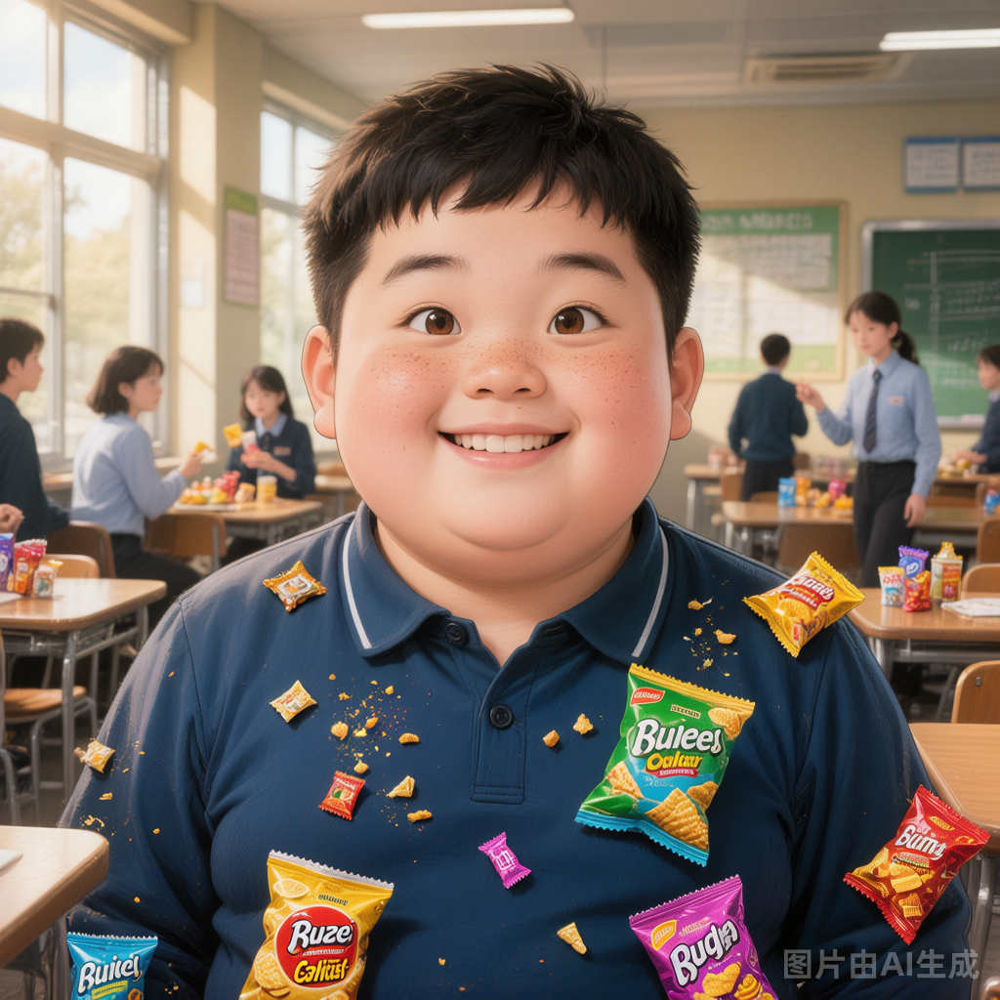

# 人类学生丙

## 基础信息

- **角色ID**：（待在 Toonflow 后台创建后填入）
- **角色类型**：npc
- **名称**：赵小胖
- **头像**：

## 描述

普通人类学生，16岁，体型偏胖，是团队的"吉祥物"。运气极差——走路会摔跤、喝水会呛到、每次躲藏都会被第一个发现。但正因为运气太差，反而总能"意外地"躲过致命攻击（因为攻击者预判了他的路线，结果他摔了一跤没在预判位置）。

## 角色参数卡

```json
{
  "name": "赵小胖",
  "raw_setting": "普通人类学生（残影 1 星，1级），运气极差但因此总能意外生还。是团队中的喜剧角色和'负面幸运星'——和他在一起，队友的运气也会变差。",
  "gender": "男",
  "age": 16,
  "level": 1,
  "level_desc": "残影 1 星",
  "personality": "乐观、憨厚、没心没肺，即使每次都倒霉也依然笑嘻嘻",
  "appearance": "圆脸，微胖，校服被撑得有点紧，脸上总是挂着憨笑",
  "voice": "",
  "skills": ["超霉运（自身运气-100%，但攻击者会因预判失误而落空）", "乐观感染（附近队友hp低速恢复）"],
  "items": ["永远吃不完的零食（但每次吃都会噎到）"],
  "equipment": [],
  "hp": 120,
  "mp": 10,
  "money": 2,
  "other": ["和用户的'好运'形成鲜明对比", "可能是某种诡异诅咒的携带者", "在团队中扮演'意外逃生者'角色"],
  "exp": 0,
  "next_level_exp": 100
}
```

## 头像

- **前景**：一位16岁微胖少年，圆脸，校服被撑得有点紧，脸上挂着憨厚的笑容，嘴角还沾着零食碎屑，二次元动漫风格，半身像，乐观开朗的神情，可爱的圆脸，眯起的眼睛，阳光而单纯
- **背景**：学校食堂，桌上散落着零食包装袋，周围同学或惊恐或无奈地看着他，氛围轻松中带着一丝荒诞喜剧感

## 语音

- **模式**：prompt_voice
- **提示词**：16岁少年音，声音憨厚带着乐观的笑意，即使说着倒霉的事也笑嘻嘻的；说话时偶尔会喘气（因为体型微胖），吃东西时会发出满足的咀嚼声；当遇到危险时声音会陡然拔高变得尖锐，带着惊慌失措的喜剧感，倒霉却又让人忍俊不禁
- **参考音频**：（待生成）
