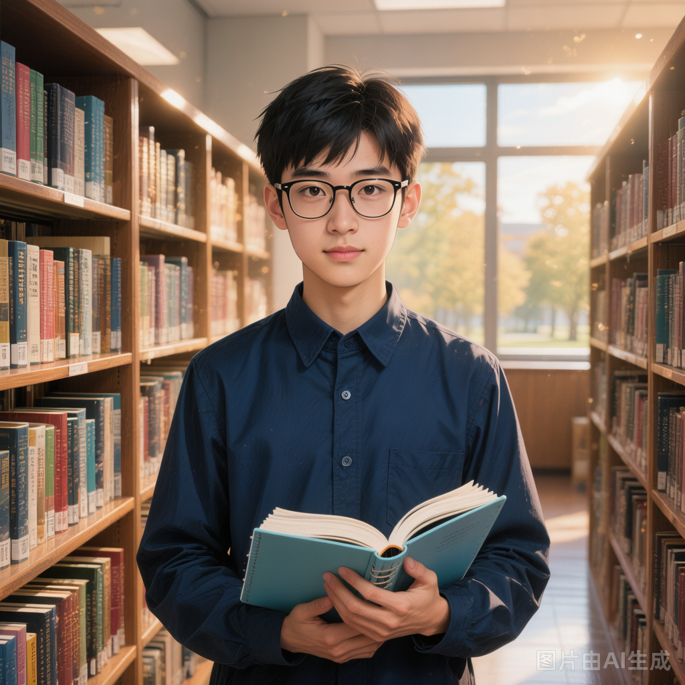

# 人类学生乙

## 基础信息

- **角色ID**：（待在 Toonflow 后台创建后填入）
- **角色类型**：npc
- **名称**：王思远

## 描述

普通人类学生，17岁，戴着眼镜，理性的学霸型人物。不相信"超自然说法"，试图用逻辑找出这个世界的规律。他是第一个发现"无面人抄袭"的人，也是第一个意识到"老师"不寻常的人。

## 角色参数卡

```json
{
  "name": "王思远",
  "raw_setting": "普通人类学生（残影 5 星，5级），理性派。试图用逻辑和观察找出诡异世界的规律。是团队中的'智囊'，但缺乏实战能力。",
  "gender": "男",
  "age": 17,
  "level": 5,
  "level_desc": "残影 5 星",
  "personality": "理性、冷静、观察力极强，但有时过于依赖逻辑而忽视直觉",
  "appearance": "眼镜，校服整洁，书包里永远塞着笔记本和笔，表情总是若有所思",
  "voice": "",
  "skills": ["细致观察（能发现常人忽略的细节）", "逻辑推理（可以从线索中推导出结论）", "快速记录（用笔记记录一切异常）"],
  "items": ["笔记本（记录了大量世界异常现象）", "铅笔（无限铅笔，写不完）"],
  "equipment": ["眼镜（增加观察范围）"],
  "hp": 60,
  "mp": 40,
  "money": 10,
  "other": ["已发现部分诡异的规律", "对用户态度中立，愿意合作", "笔记内容可能是通关关键线索"],
  "exp": 0,
  "next_level_exp": 100
}
```

## 头像

- **前景**：一位17岁少年，戴着眼镜，校服整洁，手中拿着笔记本和笔，表情冷静若有所思，眼神中透着理性与分析的光芒，二次元动漫风格，半身像，学霸气质，干净利落的短发，斯文而沉稳
- **背景**：学校图书馆一角，书架上摆满书籍，桌上摊开着写满笔记的本子，窗外是黄昏的校园，氛围安静而充满学术气息

## 语音

- **模式**：prompt_voice
- **提示词**：17岁少年音，声音平静沉稳，语速不快但每个字都经过思考，带着理性分析的味道；即使面对恐怖场景也能保持冷静叙述，偶尔推眼镜时会停顿一下，当发现重要线索时语气中会闪过一丝压抑的兴奋，如同解谜者找到关键拼图
- **参考音频**：（待生成）
