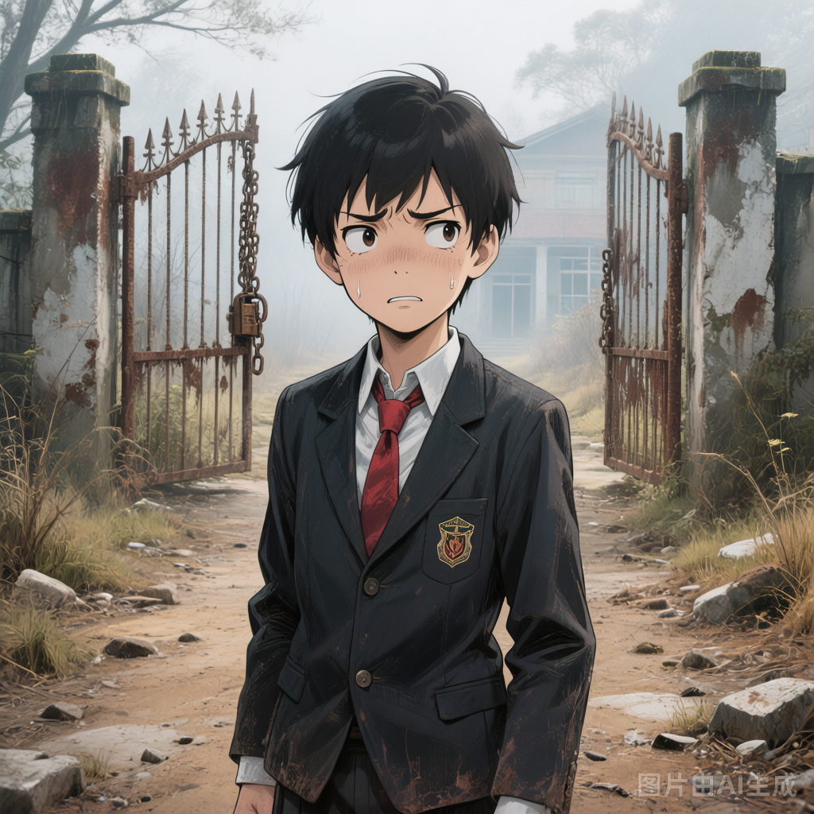

# 用户（许飞）

## 基础信息

- **角色ID**：（待在 Toonflow 后台创建后填入）
- **角色类型**：player
- **名称**：许飞

## 角色设定(性别,年龄,性格,外貌,音色特点,技能,物品,装备,等级,血量,蓝量,金钱,其他)

普通人类学生，16岁。暑假回乡下探望表妹，却误入诡异世界，被强大的诡异"小七"误认为是表哥。在这个充满危险的世界里，他唯一的"金手指"就是运气比较好——以及一个把他当亲人护着的顶级诡异。

## 角色参数卡

```json
{
  "name": "许飞",
  "raw_setting": "普通人类学生，16岁。暑假回乡下探望表妹，误入诡异世界。被诡异'小七'误认为是表哥，得到她的保护。技能是'运气比较好'，总能在危急时刻意外化险为夷。",
  "gender": "男",
  "age": 16,
  "level": 1,
  "level_desc": "",
  "personality": "善良、警觉、适应力强，面对诡异世界从恐惧到逐渐冷静",
  "appearance": "普通高中生模样，黑色短发，清秀但不出众，穿着旧校服",
  "voice": "",
  "skills": ["运气比较好(lv1)", "召唤小七"],
  "items": [],
  "equipment": [],
  "hp": 120,
  "mp": 10,
  "money": 2,
  "other": ["被小七误认为表哥", "运气属性极高，关键时刻总能意外脱险"],
  "exp": 0,
  "next_level_exp": 100
}
```

## 头像(ai生图形象描述)

- **前景**：一位16岁少年，普通学生模样，穿着略显旧色的校服，表情困惑而警觉，眼神中带着误入异世界的不安，二次元动漫风格，半身像，平凡而真实的少年感，黑色短发，清秀但不出众的五官
- **背景**：黄昏时分的乡村小路尽头，前方是若隐若现的诡异学校大门，雾气弥漫，氛围神秘而充满未知

## 语音

- **模式**：prompt_voice
- **提示词**：16岁少年音，清澈略带紧张，普通高中生语气，面对危险时会声音发颤但努力保持冷静
- **参考音频**：（待生成）
