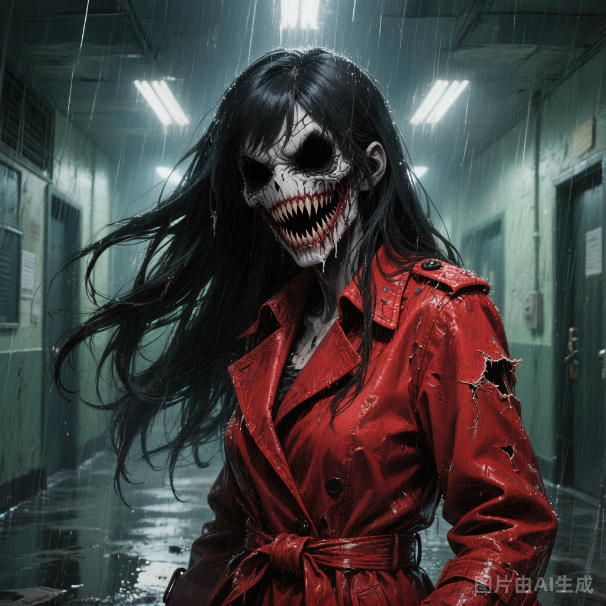

# 诡异A（裂口女）

## 基础信息

- **角色ID**：（待在 Toonflow 后台创建后填入）
- **角色类型**：npc
- **名称**：裂口女

## 描述

穿着红色风衣的女人，总是站在学校走廊的尽头。她会问每个路过的人："我美吗？"——如果回答"不美"，会被当场撕裂；如果回答"美"，她会裂开嘴到耳根，说"那我们一起变得更美吧"，然后将受害者带走。

## 角色参数卡

```json
{
  "name": "裂口女",
  "raw_setting": "经典诡异形象（阴煞 7 星，34级），出现在学校走廊、厕所、楼梯间。以'我美吗'的经典问题诱杀人类。属于中等级诡异，智慧不高但杀伤力极强。",
  "gender": "女",
  "age": "未知",
  "level": 34,
  "level_desc": "阴煞 7 星",
  "personality": "执着于'美'的概念，反复问同一个问题，无法理解复杂欺骗",
  "appearance": "红色风衣，长发遮面，嘴部可裂开至耳根，露出无数尖牙",
  "voice": "",
  "skills": ["美貌质问（强制目标回答，无法拒绝）", "裂口撕咬（近战高伤害）", "走廊闪现（在走廊范围内瞬移）"],
  "items": [],
  "equipment": [],
  "hp": 400,
  "mp": 200,
  "money": 0,
  "other": ["触发条件：回答'不美'必死；回答'美'被带走；回答模糊可能逃脱（靠运气）", "小七可以压制她"],
  "exp": 0,
  "next_level_exp": 0
}
```

## 头像

- **前景**：一位身穿红色风衣的女性，长发遮住了大半张脸，只露出裂开到耳根的嘴角和无数尖牙，眼神空洞而疯狂，二次元恐怖动漫风格，半身像，暗红主色调，诡异而令人毛骨悚然的视觉冲击
- **背景**：昏暗的学校走廊尽头，一盏闪烁的日光灯下，墙壁斑驳，地面潮湿，远处是深不见底的黑暗，氛围极度压抑恐怖

## 语音

- **模式**：prompt_voice
- **提示词**：女性，声音忽远忽近如同在走廊中回荡，带着明显的电子失真感；问"我美吗"时语气甜腻如热恋中的少女，但当被回答"不美"时瞬间撕裂成尖锐刺耳的嘶吼，笑声如同玻璃碎裂般令人毛骨悚然
- **参考音频**：（待生成）
