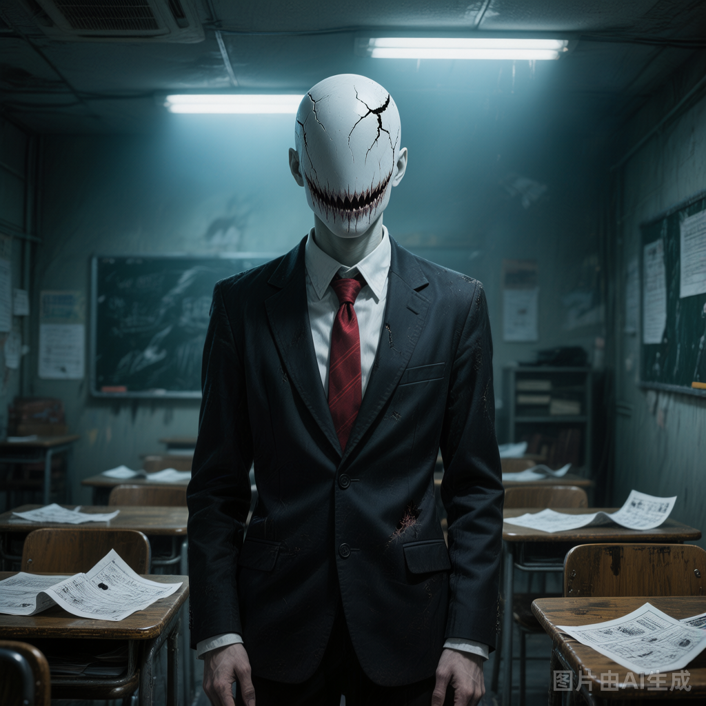

# 诡异B（无面人）

## 基础信息

- **角色ID**：npc_诡异B（无面人）
- **角色类型**：npc
- **名称**：无面人

## 角色设定(性别,年龄,性格,外貌,音色特点,技能,物品,装备,等级,血量,蓝量,金钱,其他)

教室里那个总是安静坐在角落的学生。没有五官，整张脸是光滑的皮肤。但头顶有一张嘴，可以替主人回答问题——声音是教室里其他人的混合。考试时，他会把头顶的嘴凑到试卷上方"抄写"。

性别: 未知
年龄: 看起来像17岁
性格: 沉默、模仿性强，没有自主意识，只会重复见过的行为
外貌: 穿着校服，脸部光滑无五官，头顶有一张嘴，坐姿僵硬
音色特点: 无面人没有真正的声音，头顶的嘴发出的是混合音——像是把教室里十几个人的声音重叠在一起，有男有女、有老有少，同时说话却说着同样的内容，带着令人不安的共鸣感和机械感，如同坏掉的录音机在重复播放
技能: 模仿（可以完美复制见过的人类行为），头顶嘴语（用头顶的嘴说话，声音是混合音），无痛觉（物理攻击效果减半）
物品: 无
装备: 校服（伪装用）
等级: 12
血量: 200
蓝量: 50
金钱: 0
其他: 不会主动攻击，但会模仿危险行为，用户运气好可能发现它抄袭时的破绽

## 角色参数卡

```json
{
  "name": "无面人",
  "raw_setting": "伪装成学生的低级诡异（幽行 3 星，12级），没有五官，头顶有一张嘴。可以模仿见过的人类的行为，但无法真正理解人类情感。常在教室出现。",
  "gender": "未知",
  "age": "看起来像17岁",
  "level": 12,
  "level_desc": "幽行 3 星",
  "personality": "沉默、模仿性强，没有自主意识，只会重复见过的行为",
  "appearance": "穿着校服，脸部光滑无五官，头顶有一张嘴，坐姿僵硬",
  "voice": "",
  "skills": ["模仿（可以完美复制见过的人类行为）", "头顶嘴语（用头顶的嘴说话，声音是混合音）", "无痛觉（物理攻击效果减半）"],
  "items": [],
  "equipment": ["校服（伪装用）"],
  "hp": 200,
  "mp": 50,
  "money": 0,
  "other": ["不会主动攻击", "但会模仿危险行为", "用户运气好可能发现它抄袭时的破绽"],
  "exp": 0,
  "next_level_exp": 0
}
```

## 头像(ai生图形象描述)

- **前景**：一个穿着校服的少年，脸部是一片光滑无五官的皮肤，头顶裂开一张嘴，露出参差不齐的牙齿，坐姿僵硬，二次元恐怖动漫风格，半身像，灰白主色调，诡异而令人不安的怪异感
- **背景**：昏暗的教室角落，课桌上摊开着试卷，周围同学模糊虚化，头顶的日光灯发出惨白光芒，氛围死寂而压抑

## 语音

- **模式**：prompt_voice
- **提示词**：无面人没有真正的声音，头顶的嘴发出的是混合音——像是把教室里十几个人的声音重叠在一起，有男有女、有老有少，同时说话却说着同样的内容，带着令人不安的共鸣感和机械感，如同坏掉的录音机在重复播放
- **参考音频**：（待生成）