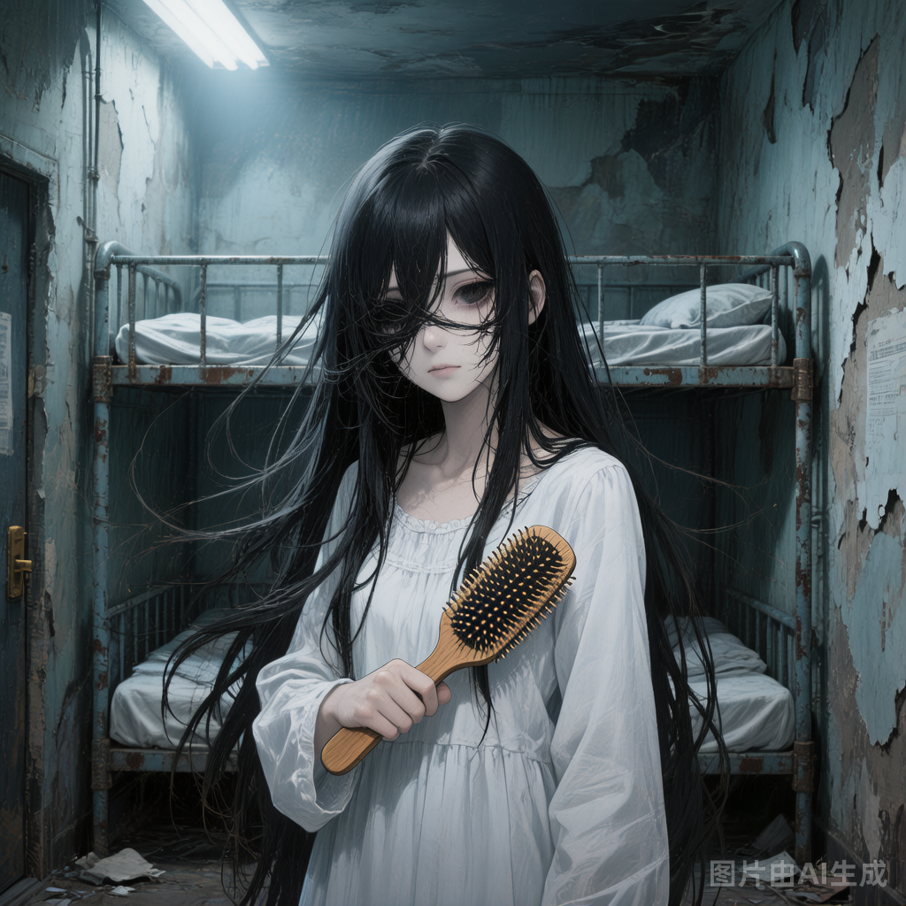

# 诡异C（长发女）

## 基础信息

- **角色ID**：npc_诡异C（长发女）
- **角色类型**：npc
- **名称**：长发女

## 角色设定(性别,年龄,性格,外貌,音色特点,技能,物品,装备,等级,血量,蓝量,金钱,其他)

女生宿舍的传说。她的头发有自主意识，会在夜间缠绕猎物，将人拖入床底。白天看起来是个普通的长发女生，安静地坐在宿舍里梳头——但如果你仔细看，她梳掉的头发会在地上蠕动。

性别: 女
年龄: 看起来像18岁
性格: 白天沉默寡言，夜间凶暴残忍；对入侵女生宿舍的男性有极强敌意
外貌: 黑色超长头发，遮住半张脸，白色睡衣，终日坐在宿舍床边梳头
音色特点: 青年女性，音色低沉如从床底或墙壁中传来的细语，带着空洞的回音；说话时伴随着头发摩擦的沙沙声，如同无数蛇在爬行；当发现猎物时声音会变得兴奋而急促，如同饥饿的野兽发现食物，阴森中透着病态的渴望
技能: 发蛇缠绕（头发如蛇群攻击并束缚目标），宿舍囚笼（将宿舍空间扭曲为迷宫），夜行（夜间战力翻倍）
物品: 木梳
装备: 木梳（诡异道具，梳落的头发会变成发蛇）
等级: 32
血量: 500
蓝量: 350
金钱: 0
其他: 活动范围：女生宿舍（男性进入会触发追杀），小七可以进入女生宿舍而不被攻击（高级诡异特权）

## 角色参数卡

```json
{
  "name": "长发女",
  "raw_setting": "寄宿在女生宿舍的中级诡异（阴煞 5 星，32级）。长发有自主意识，可以像蛇一样攻击。白天伪装成普通女生，夜间猎食。对人类男性有极强敌意。",
  "gender": "女",
  "age": "看起来像18岁",
  "level": 32,
  "level_desc": "阴煞 5 星",
  "personality": "白天沉默寡言，夜间凶暴残忍；对入侵女生宿舍的男性有极强敌意",
  "appearance": "黑色超长头发，遮住半张脸，白色睡衣，终日坐在宿舍床边梳头",
  "voice": "",
  "skills": ["发蛇缠绕（头发如蛇群攻击并束缚目标）", "宿舍囚笼（将宿舍空间扭曲为迷宫）", "夜行（夜间战力翻倍）"],
  "items": [],
  "equipment": ["木梳（诡异道具，梳落的头发会变成发蛇）"],
  "hp": 500,
  "mp": 350,
  "money": 0,
  "other": ["活动范围：女生宿舍（男性进入会触发追杀）", "小七可以进入女生宿舍而不被攻击（高级诡异特权）"],
  "exp": 0,
  "next_level_exp": 0
}
```

## 头像(ai生图形象描述)

- **前景**：一位黑色超长头发的少女，头发遮住半张脸，只露出一只冰冷的眼睛，身穿白色睡衣，手中握着一把木梳，梳落的头发在地上微微蠕动，二次元恐怖动漫风格，半身像，暗色调，阴森而诡异的美感
- **背景**：昏暗的女生宿舍，铁架床、旧衣柜、斑驳的墙壁，窗外月光惨白地照入，地上散落着蠕动的发丝，氛围阴冷而窒息

## 语音

- **模式**：prompt_voice
- **提示词**：青年女性，音色低沉如从床底或墙壁中传来的细语，带着空洞的回音；说话时伴随着头发摩擦的沙沙声，如同无数蛇在爬行；当发现猎物时声音会变得兴奋而急促，如同饥饿的野兽发现食物，阴森中透着病态的渴望
- **参考音频**：（待生成）