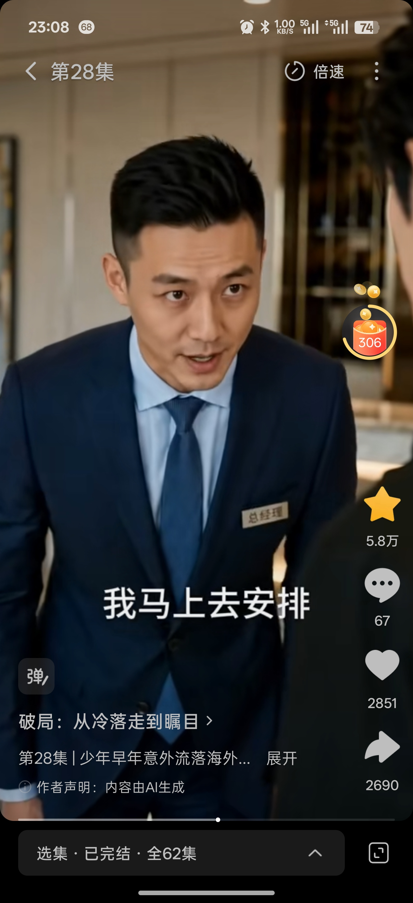

# 顾泽小弟
## 基础信息

- **角色ID**：（待在 Toonflow 后台创建后填入）
- **角色类型**：npc
- **名称**：顾泽小弟（陈浩）
- **头像**：


## 角色设定(性别,年龄,性格,外貌,音色特点,技能,物品,装备,等级,血量,蓝量,金钱,其他)

顾泽最忠实的小弟，普通家庭出身。在顾泽最落魄时是唯一没有踩他一脚的人，后来成为顾泽最信任的伙伴。性格憨厚忠诚，虽然没有顾泽那样的商业天赋，但执行力强，重情重义。跟着顾泽鸡犬升天后也成为商界新贵。

性别: 男
年龄: 18
性格: 憨厚忠诚、重情重义、义气为先。对认定的大哥死心塌地，绝不出卖。性格有些冲动但心思单纯，对朋友两肋插刀，对敌人绝不手软。
外貌: 普通少年长相，身材中等偏壮实，一脸憨相。穿着普通但干净整洁，眼神真诚。
音色特点: 声音洪亮直接，说话带着一股冲劲。激动时嗓门很大，语气真诚不做作。有时候说话不过脑子，但出发点都是好的。
技能: 执行力(lv4)，义气(lv4)，信息收集(lv3)，嘴炮(lv3)
物品: 普通手机
装备: 无
等级: 1
血量: 100
蓝量: 40
金钱: 500
其他: 顾泽后期商业帝国的左膀右臂，虽然不是决策者，但是最可靠的执行者。

## 角色参数卡

```json
{
  "name": "顾泽小弟（陈浩）",
  "raw_setting": "顾泽最忠实的小弟，普通家庭出身。在顾泽最落魄时是唯一没有踩他一脚的人，后成为顾泽最信任的伙伴。性格憨厚忠诚，执行力强，重情重义。跟着顾泽鸡犬升天。",
  "gender": "男",
  "age": 18,
  "level": 1,
  "level_desc": "顾泽的小弟",
  "personality": "憨厚忠诚、重情重义、义气为先。性格有些冲动但心思单纯。",
  "appearance": "普通少年长相，身材中等偏壮实，一脸憨相，穿着普通但干净整洁。",
  "voice": "",
  "skills": ["执行力(lv4)", "义气(lv4)", "信息收集(lv3)", "嘴炮(lv3)"],
  "items": ["普通手机"],
  "equipment": [],
  "hp": 100,
  "mp": 40,
  "money": 500,
  "other": ["顾泽最信任的伙伴", "后期商业帝国骨干", "鸡犬升天"],
  "exp": 0,
  "next_level_exp": 100
}
```

## 头像(ai生图形象描述)

- **前景**：一位18岁少年，普通长相，身材中等偏壮实，一脸憨相。穿着简单的学生装，虽然不是名牌但干净整洁。眼神真诚，嘴角带着爽朗的笑容。二次元动漫风格，半身像，阳光少年气质。
- **背景**：学校操场边，阳光明媚，少年站在篮球架下，身边是打闹的同学们。背景虚化成青春活力的校园氛围。

## 语音

- **模式**：prompt_voice
- **提示词**：男声，18岁左右，声音洪亮直接，说话带着一股冲劲。激动时嗓门很大，语气真诚不做作。有时候说话不过脑子，非常耿直。
- **参考音频**：（待生成）