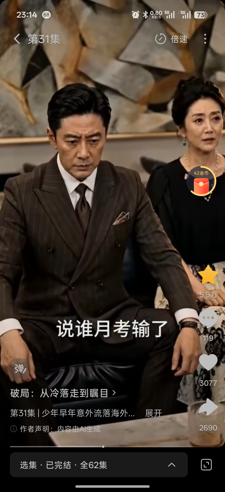

# 顾父
## 基础信息

- **角色ID**：（待在 Toonflow 后台创建后填入）
- **角色类型**：npc
- **名称**：顾铭远(顾父)
- **头像**：


## 角色设定(性别,年龄,性格,外貌,音色特点,技能,物品,装备,等级,血量,蓝量,金钱,其他)

顾家家主，顾泽和顾子航名义上的父亲。十六年前默许了护士的狸猫换太子计划，真相大白后选择了继续留养顾子航而放弃亲生儿子顾泽。外表是成功企业家，实则自私凉薄，对没有利用价值的人绝不手软。是顾泽逆袭路上需要打脸的对象之一。

性别: 男
年龄: 50
性格: 自私凉薄、唯利是图、虚伪做作。对有利用价值的人极尽拉拢，对没有价值的人弃如敝履。表面上是慈父形象，实则把子女都当成棋子。
外貌: 中年成功男士，面容严肃，眼神精明。穿着考究的西装，举止间透着商人的精明和算计。
音色特点: 声音沉稳有力，说话带着商人的圆滑和世故。教训人时语气严厉但不失控，让人感到压力但不害怕。
技能: 商业头脑(lv4)，识人用人(lv4)，利益计算(lv5)，伪装(lv3)
物品: 无
装备: 无
等级: 1
血量: 100
蓝量: 60
金钱: 5000000
其他: 顾家掌门人，与顾子航生父有利益往来。后期会因为顾泽的崛起而后悔当初的选择。

## 角色参数卡

```json
{
  "name": "顾铭远(顾父)",
  "raw_setting": "顾家家主，顾泽和顾子航名义上的父亲。十六年前默许了狸猫换太子，真相大白后选择继续留养顾子航而放弃亲生儿子顾泽。外表成功企业家，实则自私凉薄，是顾泽需要打脸的对象。",
  "gender": "男",
  "age": 50,
  "level": 1,
  "level_desc": "顾家家主",
  "personality": "自私凉薄、唯利是图、虚伪做作。把子女都当成棋子。",
  "appearance": "中年成功男士，面容严肃，眼神精明。穿着考究的西装，举止透着商人的精明和算计。",
  "voice": "",
  "skills": ["商业头脑(lv4)", "识人用人(lv4)", "利益计算(lv5)", "伪装(lv3)"],
  "items": [],
  "equipment": [],
  "hp": 100,
  "mp": 60,
  "money": 5000000,
  "other": ["顾家掌门人", "默许换子真相", "后期后悔"],
  "exp": 0,
  "next_level_exp": 100
}
```

## 头像(ai生图形象描述)

- **前景**：一位50岁左右的中年男士，面容严肃，眼神精明。穿着深色定制西装，佩戴名贵手表。双手负在身后，周身散发着企业家的威严和算计。二次元动漫风格，半身像。
- **背景**：顾氏集团总部大楼，落地窗外是城市天际线。身后是"顾氏集团"的金字招牌，书架上摆满了商业荣誉。气氛严肃压抑。

## 语音

- **模式**：prompt_voice
- **提示词**：男声，50岁左右，声音沉稳有力，说话带着商人的圆滑和世故。教训人时语气严厉但不失控。虚伪的慈父语气时让人感到不自然的温和。
- **参考音频**：（待生成）