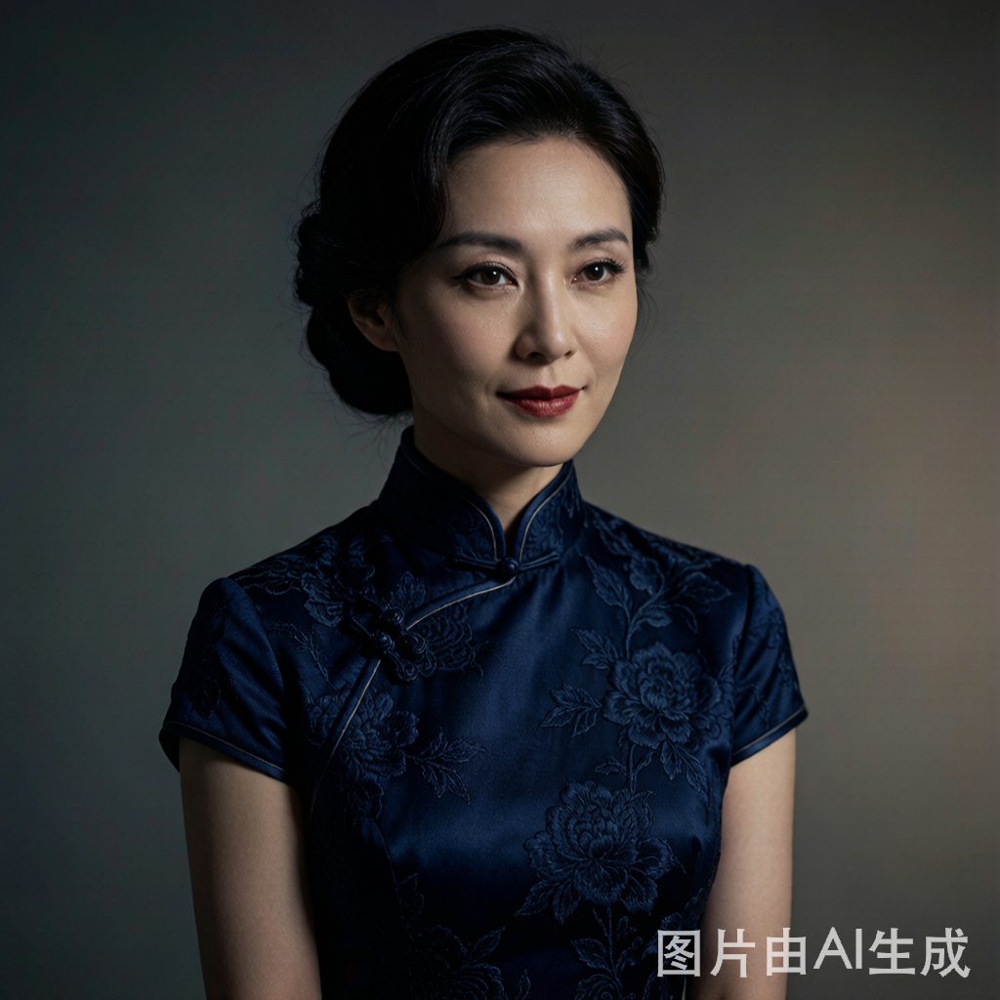

# 顾母
## 基础信息

- **角色ID**：（待在 Toonflow 后台创建后填入）
- **角色类型**：npc
- **名称**：林雅芝(顾母)
- **头像**：


## 角色设定(性别,年龄,性格,外貌,音色特点,技能,物品,装备,等级,血量,蓝量,金钱,其他)

顾家女主人，顾泽和顾子航名义上的母亲。真相比大白后，选择继续宠爱从小养大的顾子航，对亲生儿子顾泽不闻不问。表面上是慈母形象，实则偏心至极，眼里只有顾子航这个"好孩子"。
不仅领人贩子的儿子当养子（前期其他人不知道），还养出感情。年轻时被抓被威吓，被迫领养人贩子的孩子.

性别: 女
年龄: 48
性格: 偏心狭隘、溺爱无度、颠倒黑白。对顾子航极尽溺爱，对顾泽冷漠刻薄。颠倒黑白的能力一流，总能把自己偏心的行为说成"为你好"。
外貌: 中年贵妇，保养得当，看起来只有四十出头。穿着华贵，珠光宝气，举止间透着富家太太的做派。
音色特点: 女声，48岁左右，说话带着富家太太的娇气和优越感。对顾子航说话时温柔宠溺，对顾泽说话时冷淡疏离甚至尖酸刻薄。颠倒黑白时语气委屈，好像自己是受害者。
技能: 颠倒黑白(lv5)，溺爱(lv5)，偏心(lv5)，做作(lv4)
物品: 珠宝首饰，名牌包包
装备: 无
等级: 1
血量: 70
蓝量: 50
金钱: 100000
其他: 顾家实际的"内务大臣"，不仅领人贩子的儿子当养子（前期其他人不知道），还养出感情。年轻时被抓被威吓，被迫领养人贩子的孩子 .

## 角色参数卡

```json
{
  "name": "@林雅芝(顾母)",
  "raw_setting": "顾家女主人，顾泽和顾子航名义上的母亲。真相比大白后选择继续宠爱顾子航，对亲生儿子顾泽不闻不问。表面慈母实则偏心至极，是顾泽需要打脸的对象。",
  "gender": "女",
  "age": 48,
  "level": 1,
  "level_desc": "顾家女主人",
  "personality": "偏心狭隘、溺爱无度、颠倒黑白。总能把自己偏心的行为说成'为你好'。",
  "appearance": "中年贵妇，保养得当，穿着华贵，珠光宝气，举止透着富家太太的做派。",
  "voice": "",
  "skills": ["颠倒黑白(lv5)", "溺爱(lv5)", "偏心(lv5)", "做作(lv4)"],
  "items": ["珠宝首饰", "名牌包包"],
  "equipment": [],
  "hp": 70,
  "mp": 50,
  "money": 100000,
  "other": ["顾家内务大臣", "偏心顾子航", "后期后悔"],
  "exp": 0,
  "next_level_exp": 100
}
```

## 头像(ai生图形象描述)

- **前景**：一位48岁左右的中年女性，保养得当看起来只有四十出头。身穿名贵旗袍或套装，佩戴翡翠项链和钻石耳环。表情端庄但眼神透着精明，嘴角带着富家太太特有的矜持微笑。二次元动漫风格，半身像。
- **背景**：顾家别墅的豪华客厅，水晶吊灯璀璨夺目，身后是精致的红木家具和名贵字画。背景虚化成暖色调的奢华氛围。

## 语音

- **模式**：prompt_voice
- **提示词**：女声，48岁左右，说话带着富家太太的娇气和优越感。对顾子航说话时温柔宠溺，对顾泽说话时冷淡疏离甚至尖酸刻薄。颠倒黑白时语气委屈，好像自己是受害者。
- **参考音频**：（待生成）