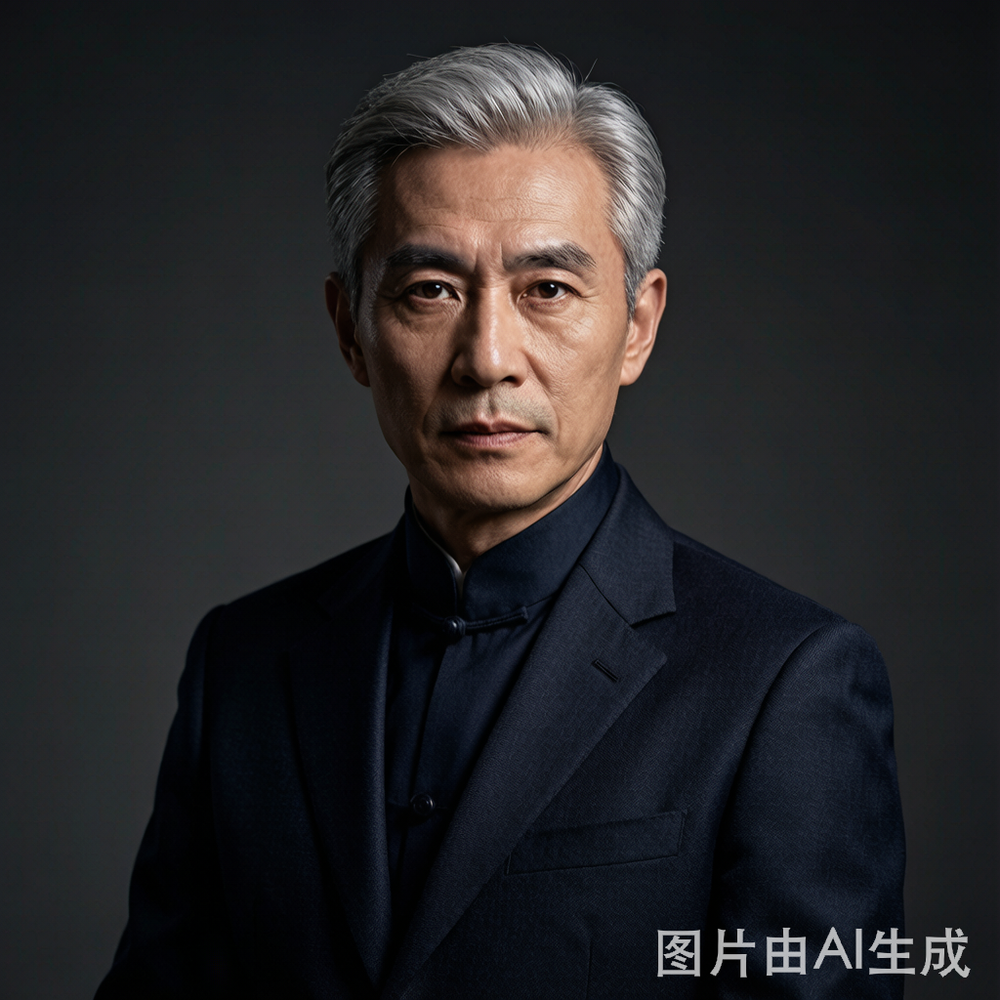

# 温父
## 基础信息

- **角色ID**：（待在 Toonflow 后台创建后填入）
- **角色类型**：npc
- **名称**：温建业
- **头像**：


## 角色设定(性别,年龄,性格,外貌,音色特点,技能,物品,装备,等级,血量,蓝量,金钱,其他)

锐星贵族学校校长，商界和学界的双栖传奇。外表威严但内心公正，对女儿的眼光深信不疑。在顾子航利用学校规则陷害顾泽时，会因为女儿温知予的缘故出面主持公道，狠狠打脸顾家。手握锐星贵族学校的生杀大权，在整个城市都有极高的声望和影响力。

性别: 男
年龄: 50
性格: 威严正直、公正无私、老谋深算。对外是雷厉风行的铁腕校长，对女儿却是宠爱有加的慈父。看人眼光毒辣，对真正的人才不拘一格，对虚伪小人绝不姑息。
外貌: 中年成功男士，鬓角微霜但精神矍铄，目光深邃透着智慧。穿着定制西装，气场强大，站在那里就让人不由自主地肃然起敬。
音色特点: 声音浑厚有力，不怒自威。说话语速缓慢沉稳，每个字都透着让人信服的力量。批评人时声音压低，透着不容置疑的威严。
技能: 识人用人(lv5)，商业头脑(lv5)，人脉经营(lv5)，运筹帷幄(lv4)
物品: 无
装备: 无
等级: 1
血量: 100
蓝量: 80
金钱: 1000000
其他: 锐星贵族学校创始人兼校长，家族企业在多个领域都有布局。与顾家有商业往来但并不亲近。

## 角色参数卡

```json
{
  "name": "温父（温建业）",
  "raw_setting": "锐星贵族学校校长，商界和学界的双栖传奇。外表威严但内心公正，手握学校生杀大权。对女儿的眼光深信不疑，在顾子航陷害顾泽时会出面主持公道。是顾泽破局的重要助力。",
  "gender": "男",
  "age": 50,
  "level": 1,
  "level_desc": "锐星校长",
  "personality": "威严正直、公正无私、老谋深算。对女儿宠爱有加，看人眼光毒辣。",
  "appearance": "中年成功男士，鬓角微霜但精神矍铄，目光深邃透着智慧。穿着定制西装，气场强大。",
  "voice": "",
  "skills": ["识人用人(lv5)", "商业头脑(lv5)", "人脉经营(lv5)", "运筹帷幄(lv4)"],
  "items": [],
  "equipment": [],
  "hp": 100,
  "mp": 80,
  "money": 1000000,
  "other": ["锐星学校创始人", "家族企业掌门人", "顾泽的重要助力"],
  "exp": 0,
  "next_level_exp": 100
}
```

## 头像(ai生图形象描述)

- **前景**：一位50岁左右的中年男士，鬓角微霜但精神矍铄，目光深邃透着智慧和威严。穿着深色定制西装，领带一丝不苟。双手交叠放在身前，周身散发着上位者的气场。二次元动漫风格，半身像，成功企业家气质。
- **背景**：校长办公室，落地窗外是锐星学校的标志性钟楼和花园，书架上摆满了各种荣誉证书和奖杯。身后是一幅"锐意进取，星火相传"的校训墨宝。气氛庄重威严。

## 语音

- **模式**：prompt_voice
- **提示词**：男声，中年，50岁左右，声音浑厚有力，不怒自威。说话语速缓慢沉稳，每个字都透着让人信服的力量。批评人时声音压低带着威严，赞赏人时语气温和但仍保持长辈的矜持。
- **参考音频**：（待生成）