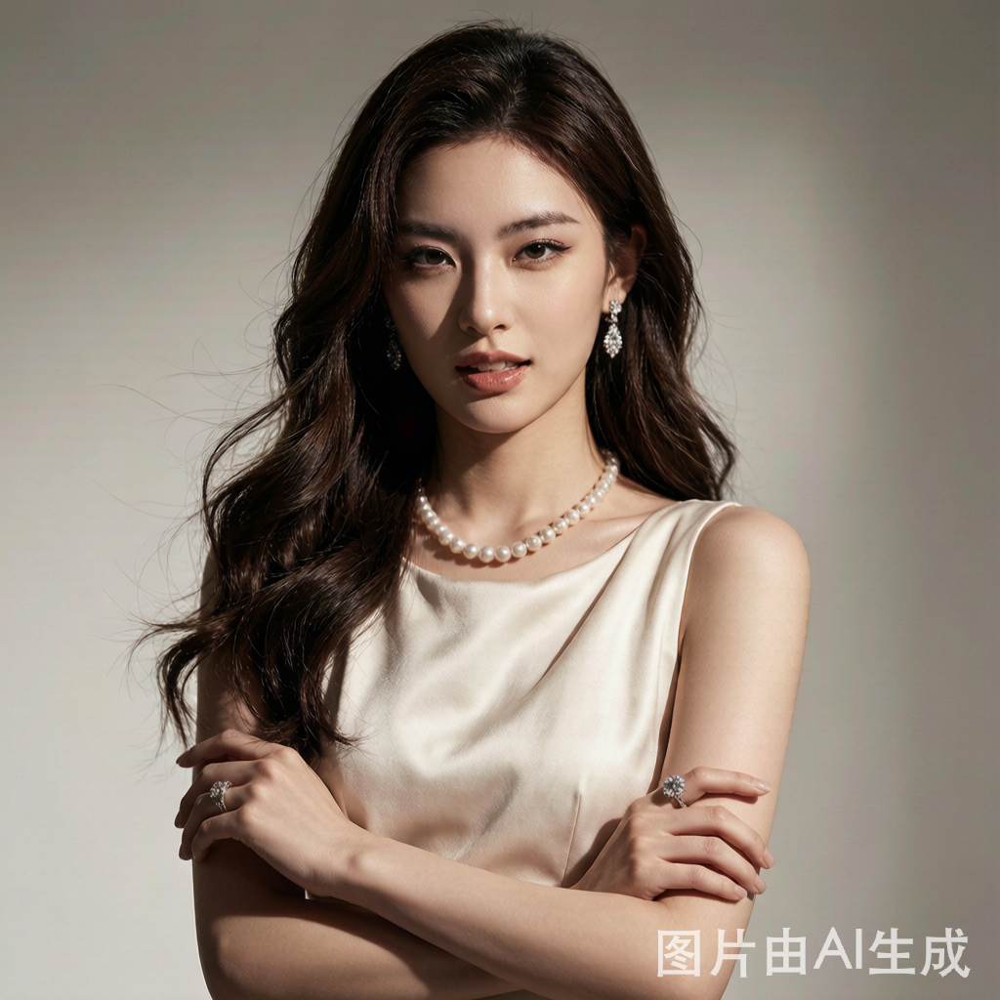

# 白家千金
## 基础信息

- **角色ID**：（待在 Toonflow 后台创建后填入）
- **角色类型**：npc
- **名称**：白家千金（白诗韵）
- **头像**：


## 角色设定(性别,年龄,性格,外貌,音色特点,技能,物品,装备,等级,血量,蓝量,金钱,其他)

白家千金，顾泽商业版图的引路人。出身顶级豪门白家，本人也是商界新星，高冷霸道，眼光极高，一般人入不了她的眼。在一次商业活动中偶然注意到顾泽的潜力，对他产生兴趣，成为顾泽迈向更高层次的跳板。性格冷傲但并非不讲理，对有实力的人会给予尊重。

性别: 女
年龄: 22
性格: 高冷霸道、眼光极高、雷厉风行。说话直接从不拐弯，不喜欢浪费时间。对认定的人才不吝啬资源，对平庸之辈绝不假以辞色。有着与年龄不符的商业天赋。
外貌: 冷艳动人，气场强大，身材高挑。精致的妆容和得体的穿着尽显豪门千金的气质。眼神锐利如鹰，站在那里就是全场焦点。
音色特点: 声音清冷中带着一丝慵懒，说话简洁干脆，从不废话。语气带着天生的优越感，但并不盛气凌人。欣赏某人时语气会稍微柔和，但仍保持矜持。
技能: 商业头脑(lv5)，投资眼光(lv5)，家族背景(lv4)，人脉经营(lv4)
物品: 限量版豪车，顶级珠宝
装备: 无
等级: 1
血量: 80
蓝量: 70
金钱: 100000
其他: 白家是本市最顶级的豪门之一，在金融、地产、科技等领域都有布局。白诗韵是白家这一代最出色的继承人。

## 角色参数卡

```json
{
  "name": "白家千金（白诗韵）",
  "raw_setting": "白家千金，顾泽商业版图的引路人。出身顶级豪门，高冷霸道，眼光极高。在一次商业活动中注意到顾泽的潜力，成为他迈向更高层次的跳板。",
  "gender": "女",
  "age": 22,
  "level": 1,
  "level_desc": "白家继承人",
  "personality": "高冷霸道、眼光极高、雷厉风行。说话直接，从不废话。对有实力的人给予尊重。",
  "appearance": "冷艳动人，气场强大，身材高挑。精致的妆容和得体的穿着尽显豪门千金气质。",
  "voice": "",
  "skills": ["商业头脑(lv5)", "投资眼光(lv5)", "家族背景(lv4)", "人脉经营(lv4)"],
  "items": ["限量版豪车", "顶级珠宝"],
  "equipment": [],
  "hp": 80,
  "mp": 70,
  "money": 100000,
  "other": ["白家继承人", "顾泽的引路人", "商界新星"],
  "exp": 0,
  "next_level_exp": 100
}
```

## 头像(ai生图形象描述)

- **前景**：一位22岁左右的年轻女性，冷艳动人，气场强大。身穿剪裁精致的白色职业套装，身材高挑挺拔。眼神锐利如鹰，嘴角带着淡淡的傲气。二次元动漫风格，半身像，豪门千金气质。
- **背景**：高档写字楼落地窗前，俯瞰整个城市CBD的繁华景象。身后是现代化的办公环境，她站在光影交界处，自信从容。气氛干练专业。

## 语音

- **模式**：prompt_voice
- **提示词**：女声，22岁左右，声音清冷中带着一丝慵懒，说话简洁干脆从不废话。语气带着天生的优越感但并不盛气凌人。欣赏某人时语气稍微柔和，但仍保持矜持。
- **参考音频**：（待生成）